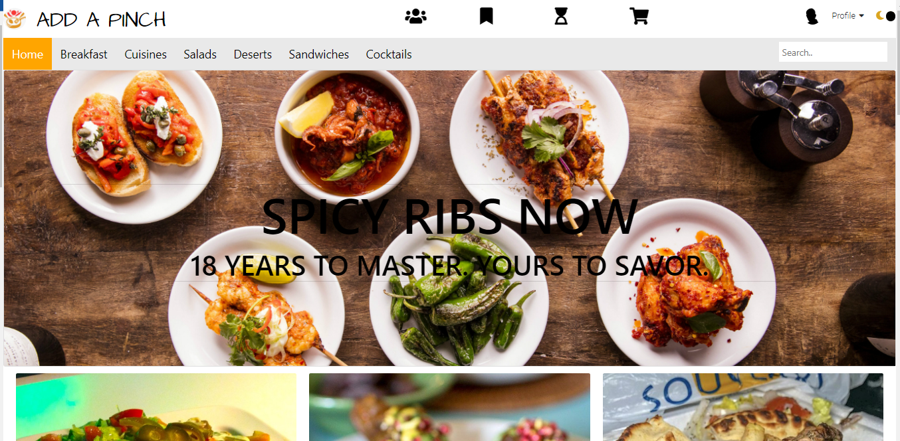
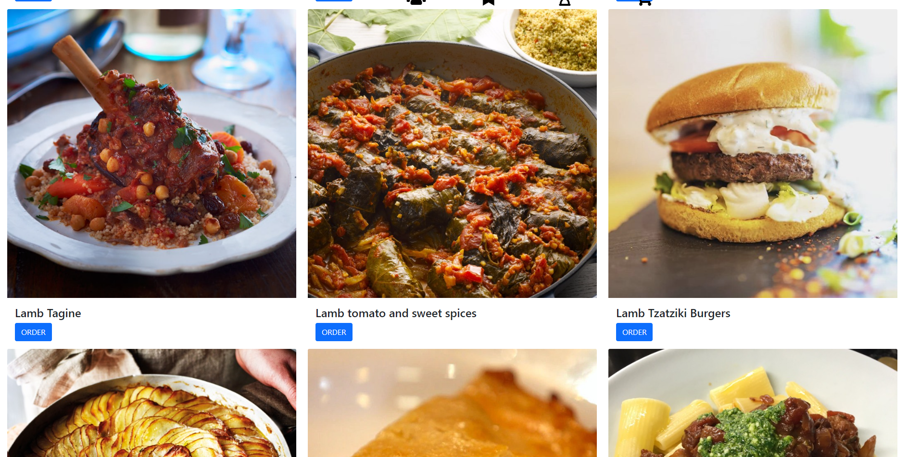
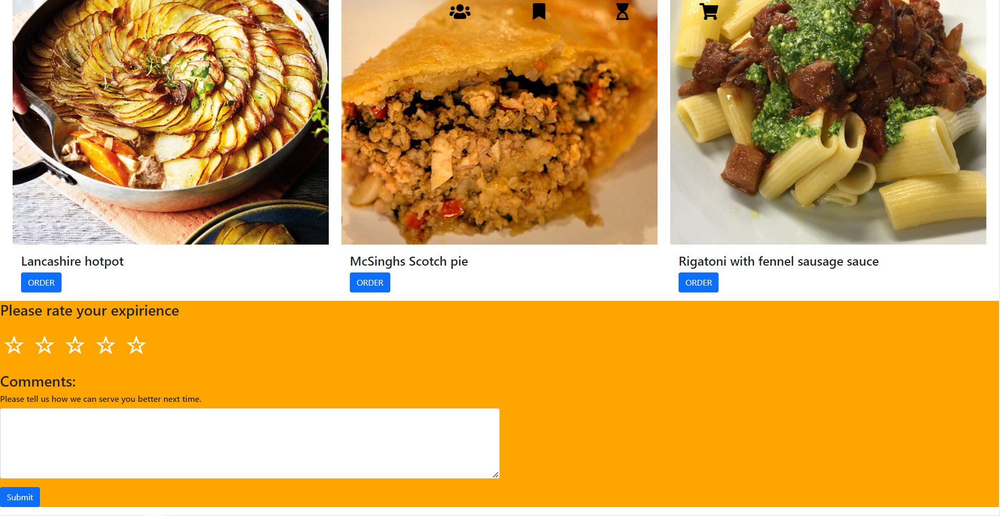

# Welcome to Add A Pinch! 
## Your one stop for awesome food and drink in Nairobi.
#### This is a web application designed using HTML, CSS, JS, the mealDB API, and Bootstrap allowing users to order their meals in the restaurant and rate and comment on their expiprience there after.

## Link to Deployed Site

[Add A Pinch](https://inno09.github.io/Phase-1-Restaurant-Project/)

## Table of Contents
  * [Motivation and Technologies](#motivation)
  * [Functionality](#functionality)
  * [Challenges](#challenges)
  * [Usage](#usage)

## Motivation

I aimed to create a web application for users to order both online and within the Restaurant in a simple and easy to use fashion. I wanted the users to be able to order automatically without the need for table waiting. The rate and comment feature also allows management to get the necessary customer data on meals they enjoyed and how to better serve the customers next time.

#### Technologies
* HTML
* CSS 
* JavaScript
* TheMealDB API

## Functionality

#### The demo shows the main functions of Add A Pinch:
* The landing page introduces the site, has buttons to navigate to the Food and Drinks section, and includes a "Featured Meal" section for users who prefer not to spend time searching.
* The user scrolls down through the page and looks at the various dishes and drinks available at the time and clicks order to alert the staff on what they would like to have.
* The user will then recieve an alert that the order has been recieved and is getting prepared.
* After the meal the user can scroll to the bottom and rate the service out of 5 and the feed back can be used for further improvement by management.
* The user can also leave comments which will be viscible to other users and can help the get a better feel for the restaurant, this brings transparenc.

## Challenges 
The major challenge I faced was trying to merge a good UX design with JS actions. In the end some compromises were made in both ends to ensure functionality and good UX design.

## Usage
* Order meals in a fast and efficient manner. 
* Use this to help understand how to make API calls.
* Comments and rate section and having the data appended.
* Incorporate event listeners.
* Learn how to develop a web application and host them on git pages . 

